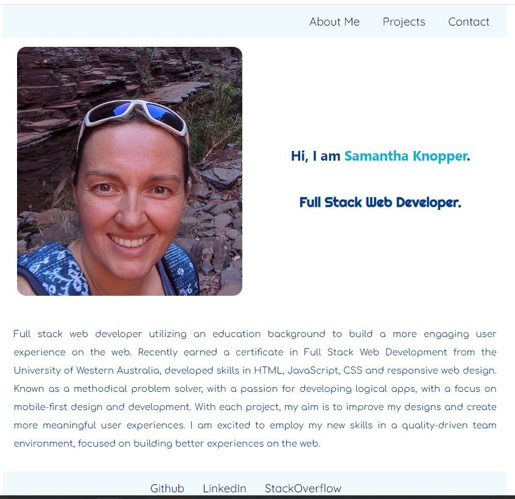

# React Portfolio

## Description
This is my portfolio created with React.js. It contains an About page, Portfolio page, Contact page, and Resume can be downloaded from the contact page. The Portfolio page contains a list of 4 of my favorite applications. In the footer are links to my Github, LinkedIn, and StackOver Flow.

## Screenshot
)

## References
https://www.w3schools.com/
https://create-react-app.dev/docs/deployment/#github-pages
https://www.youtube.com
https://coolors.co/

## Application Link
https://samw1s3.github.io/react_portfolio/